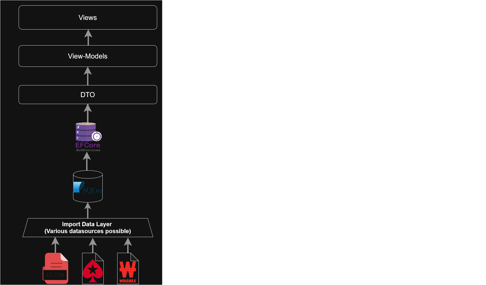

# PokerPuzzle - Main idea
PokerPuzzle is a desktop application designed to train poker hand reading.
It lets users replay real poker hands action by action and reason about opponents’ possible hands using only in-game information: player actions, pot sizes, and community cards.

# Why this project exists
Coming from a chess background, I was used to learning through puzzles: isolated, high-leverage positions designed to train decision-making in the most critical moments of the game.
In chess, this ecosystem is mature and largely open, making high-quality learning material widely accessible.

When transitioning to poker, I found the learning landscape very different. Much of the educational content is opaque, fragmented, or locked behind paywalls, and there is no direct equivalent to chess puzzles that focus on reasoning under incomplete information.

PokerPuzzle was created to explore a similar learning approach for poker. Instead of solving static problems, the application places the user inside real hands and encourages them to reason street by street using only the information that would be available in an actual game: player actions, pot sizes, and community cards.

Hand reading is, in my view, one of the most critical skills in poker, especially in exploitative play. Correctly estimating an opponent’s range allows for better bluffing decisions, more accurate value betting, and disciplined folds when behind. This project exists to isolate and train that skill in a focused, repeatable way.

# Features
## Implemented Features
### Gameplay
- Replay real poker hands street by street
- Step through individual player actions in sequence
- Visualize community cards, pot sizes, and player positions
- Pause before showdown to reason about opponents’ possible hands
### Game handling
- Load a random game from the local database
- Mark games as favorites for later review
- Browse favorite games with basic metadata
## Planned Improvements
- Game selection with filtering (to target specific kind of games and improve in certain positions)
- Custom game import (import your own games to the database)

# Architecture - Overview
PokerPuzzle follows a classic MVVM architecture, with a clear separation between UI, application logic, and data persistence.

WPF views interact exclusively with ViewModels through bindings and commands. ViewModels coordinate user interactions and application state, while remaining independent from UI implementation details. Data exchanged with the persistence layer is structured through lightweight DTOs.

The application relies on a local SQLite database accessed through EF Core.

Data ingestion is handled by a dedicated import layer. This layer acts as a boundary between external data formats and the internal data model, allowing new sources or formats to be integrated without impacting the rest of the application.

## Designing for Evolving Data
Poker data lacks a widely accepted structural standard, especially when compared to domains like chess where formats and conventions are well established. The initial dataset used in this project came from a JSON file with a non-standard and highly specific structure.

Because of this, the application was designed with data evolution in mind. The import layer is intentionally decoupled from the core domain and persistence models, making it possible to adapt to new data sources or formats without impacting the rest of the application. This allows additional hand histories or alternative representations to be integrated with limited refactoring.

This approach reflects a deliberate choice to favor long-term adaptability over tightly coupling the application to a single data format.